# Proyecto Pasta Loca

## Equipo del Proyecto

El equipo detrás de este análisis está compuesto por:

- **Francesc Pujol Contreras**: *Data Engineer*. Responsable de la limpieza de bases de datos, creación de pipelines de datos y desarrollo de librerías utilizadas por los analistas.
  
- **Maria Alba Godoy Dominguez**: *Business Analyst - Credit Risk Management*. Encargada del análisis de morosidad y riesgos crediticios.

- **Alejandro Manzano**: *Business Analyst - Profitability Analysis*. Enfocado en el análisis de la rentabilidad del negocio.


## Diagrama de Flujo del Servicio


## Métricas para Analizar Rentabilidad Financiera de BP

1. **% Revenue**:
```math
\text{% Revenue} = \frac{\text{ingresos por fees de adelanto + ingresos por fees de prorrogas}}{\text{total adelantos}} \times 100
```

2. **Porcentaje de Adelantos con Fee**:
```math
\text{Porcentaje de adelantos con fee} = \frac{\text{adelantos con fee}}{\text{total adelantos}} \times 100
```

## Métricas para Analizar Comportamiento de Clientes de BP

1. **Porcentaje de Clientes Repetitivos**:
```math
\text{Porcentaje de clientes repetitivos} = \frac{\text{Clientes repetitivos}}{\text{Total de Clientes}} \times 100
```

2. **Porcentaje de Nuevos Clientes que Pagan Fees**:
```math
\text{Porcentaje de nuevos clientes que pagan fees} = \frac{\text{Clientes nuevos que pagan fees}}{\text{Total de clientes nuevos}} \times 100
```

3. **Porcentaje de Clientes Repetitivos que Pagan Fees**:
```math
\text{Porcentaje de clientes repetitivos que pagan fees} = \frac{\text{Clientes repetitivos que pagan fees}}{\text{Total de clientes repetitivos}} \times 100
```

4. **Tasa de Incumplimiento de Nuevos Clientes**:
```math
\text{Tasa de incumplimiento de nuevos clientes} = \frac{\text{Clientes nuevos que no cumplen el plazo}}{\text{Total de clientes nuevos}} \times 100
```

5. **Tasa de Incumplimiento de Clientes Repetitivos**:
```math
\text{Tasa de incumplimiento de clientes repetitivos} = \frac{\text{Clientes repetitivos que no cumplen el plazo}}{\text{Total de clientes repetitivos}} \times 100
```

---

## Estructura de los Datos

### Cash_Request

#### CR Campo: Status (23970 registros)

- **money_back**: 16397 registros. El CR fue reembolsado exitosamente.
- **rejected**: 6568 registros. El CR necesitó una revisión manual y fue rechazado.
- **direct_debit_rejected**: 831 registros. El intento de débito directo SEPA falló.
- **active**: 59 registros. Los fondos fueron recibidos en la cuenta del cliente.
- **transaction_declined**: 48 registros. No se pudo enviar el dinero al cliente.
- **canceled**: 33 registros. El usuario no confirmó el CR en la app, fue cancelado automáticamente.
- **direct_debit_sent**: 34 registros. Se envió un débito directo SEPA, pero aún no se confirma el resultado.

#### CR Campo: Transfer Type

- **instant**: El usuario eligió recibir el adelanto instantáneamente.
- **regular**: El usuario eligió no pagar inmediatamente y esperar la transferencia.

#### CR Campo: Recovery Status

- **null**: El CR nunca tuvo un incidente de pago.
- **completed**: El incidente de pago fue resuelto (el CR fue reembolsado).
- **pending**: El incidente de pago aún está abierto.
- **pending_direct_debit**: El incidente de pago sigue abierto, pero se ha lanzado un débito directo SEPA.

---

### Fees

#### Fees: Type

- **instant_payment**: Fees por adelanto instantáneo.
- **split_payment**: Fees por pago fraccionado (en caso de un incidente).
- **incident**: Fees por fallos de reembolsos.
- **postpone**: Fees por la solicitud de posponer un reembolso.

#### Fees: Status

- **confirmed**: El usuario completó una acción que creó un fee.
- **rejected**: El último intento de cobrar el fee falló.
- **cancelled**: El fee fue creado pero cancelado por algún motivo.
- **accepted**: El fee fue cobrado exitosamente.

#### Fees: Category

- **rejected_direct_debit**: Fees creados cuando el banco del usuario rechaza el primer débito directo.
- **month_delay_on_payment**: Fees creados cada mes hasta que el incidente se cierre.

#### Fees: Charge Moment

- **before**: El fee se cobra en el momento de su creación.
- **after**: El fee se cobra cuando el CR es reembolsado.

---

## Profitability Analysis

###  Analysis of Revenue Growth and Fee Behavior:

El análisis comenzó observando la evolución del índice **% Revenue** en total y por cada servicio.

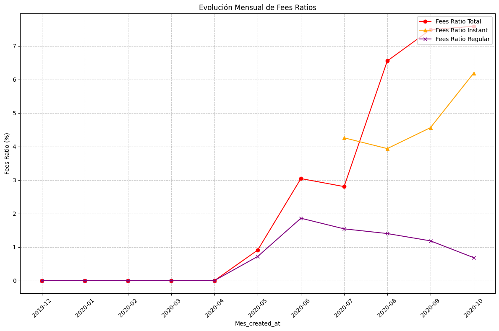

Se observa un importante aumento de la rentabilidad del negocio desde 07-2020, alcanzando un incremento del KPI de un **41%** entre 07-2020 y 10-2020.

A continuación, analizamos la composición de este KPI para determinar si el aumento se debe a un incremento en el cobro de fees o a una reducción en los montos prestados.

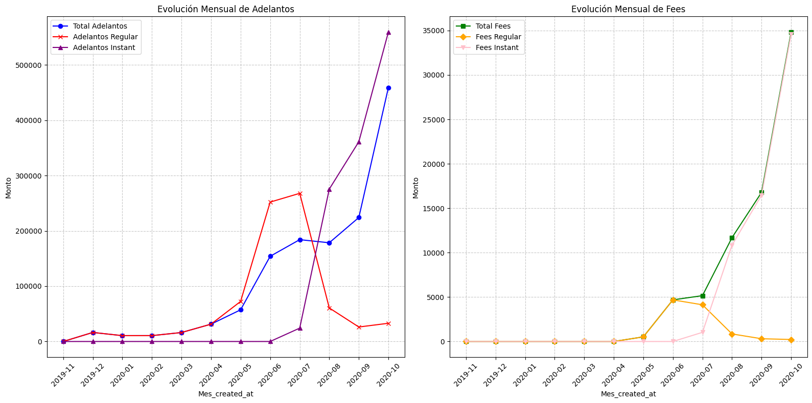

Entre 07-2020 y 10-2020, vemos que hubo un aumento de los adelantos del **147%**, mientras que los fees crecieron un **500%**.

Con esta información, pasamos a analizar más detalladamente el comportamiento de los fees.

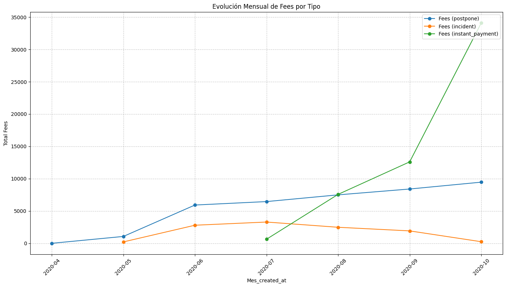

En esta gráfica, podemos ver claramente que el crecimiento exponencial de los fees se debe al éxito del servicio **Instant**.

A continuación, nos centramos en el servicio **Instant** para analizar los diferentes sub-servicios ofrecidos, específicamente las dos opciones de pago de fees: **before** y **after**.

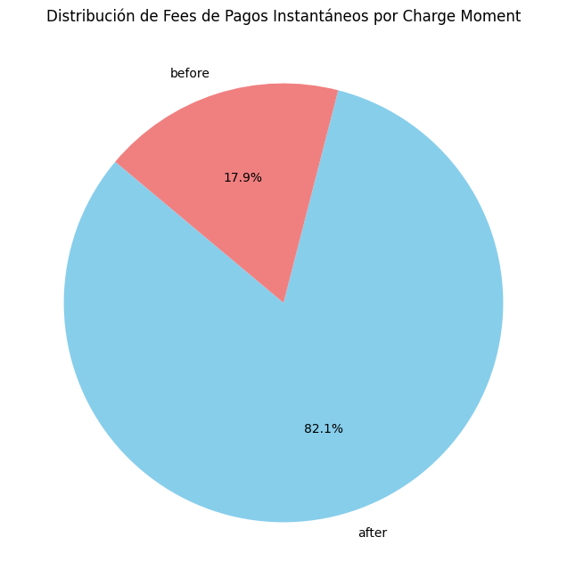

El **82%** de los **CR** de **Instant Payment** utilizan el sub-servicio **after**. Al observar la evolución en el tiempo, vemos una tendencia creciente en ambos sub-servicios, sin que haya una transferencia significativa de uno a otro. Lo que sí se observa es un aumento más pronunciado en el servicio **after**.

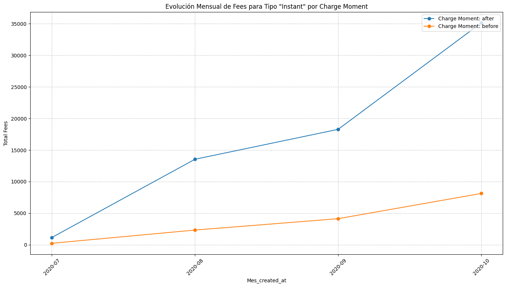

A continuación, analizamos la morosidad en cada uno de estos dos sub-servicios, con la hipótesis de que el servicio **"after"** podría ser más susceptible a la morosidad. Sin embargo, sorprendentemente encontramos lo contrario:

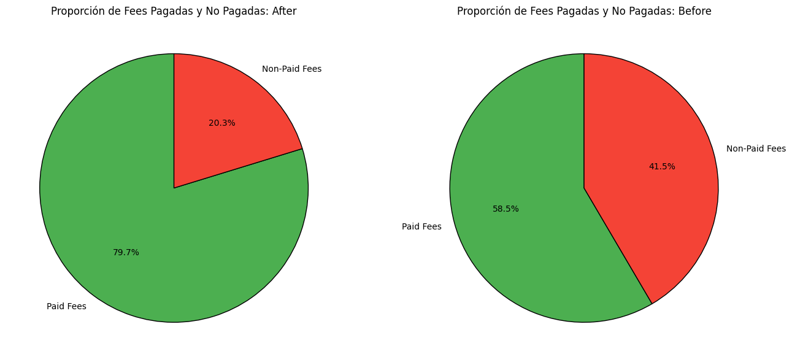

Como se puede ver, la tasa de impagos del sub-servicio **"charge moment"** en el servicio **Instant** es mayor para los clientes que pagan **before** que para los que pagan **after**. Dado que el sub-servicio **before** representa solo el **20%**, podemos proponer nuestro primer plan de acción:

### PLAN DE ACCIÓN:
**Eliminar el subservicio "charge moment" del servicio Instant.**

### IMPACTO:
- **Morosidad general ponderada con ambos servicios** = **28,4%**.
- **Eliminando el subservicio "before"** reduciría la morosidad general ponderada solo con **after** a **25%**, lo que representaría una reducción del **3%** en la morosidad.


# **Cohortes: Segmentaciones para Análisis**

Hemos realizado un análisis de cohortes basado en la fecha de la primera solicitud de adelanto. Para este análisis, tomamos las siguientes asunciones clave:

1. Se consideran **solo los fees pagados**.
2. Se consideran **solo adelantos con certeza de haber sido pagados por BP** (es decir, aquellos con el campo `cash_request_received_date` no nulo).

---

### **Diagrama de Cohortes**

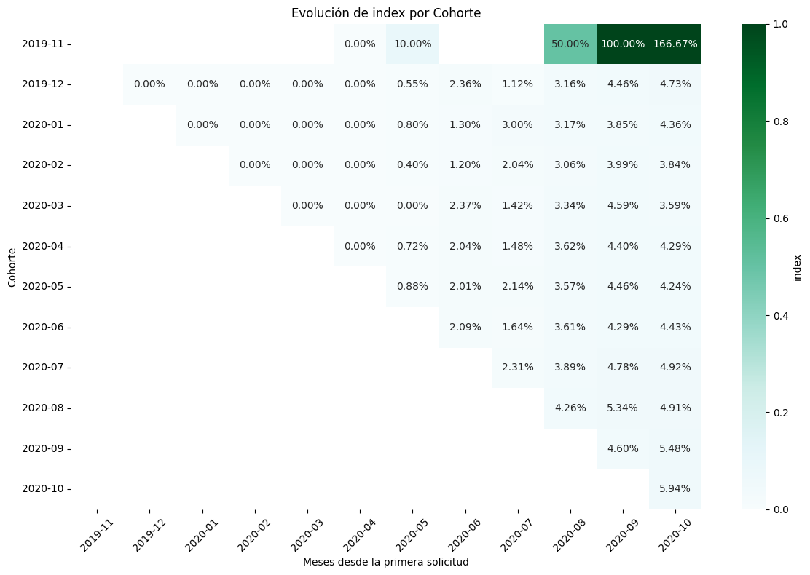

Al observar la **primera diagonal** del gráfico, podemos ver el **porcentaje de ingresos** para cada cohorte respecto a su primera solicitud de adelanto de efectivo. Es evidente que este valor aumenta con el tiempo, especialmente antes del **boom del servicio Instant**, periodo en el que se acentúa este crecimiento.

Este aumento en el índice se debe al auge del servicio **Instant**, por lo que realizamos una cohorte provisional para segmentar a los usuarios en tres grupos:

1. **Usuarios 100% Instant**
2. **Usuarios 100% Regular**
3. **Usuarios Mixtos**

---

### **Evolución de las Cohortes**

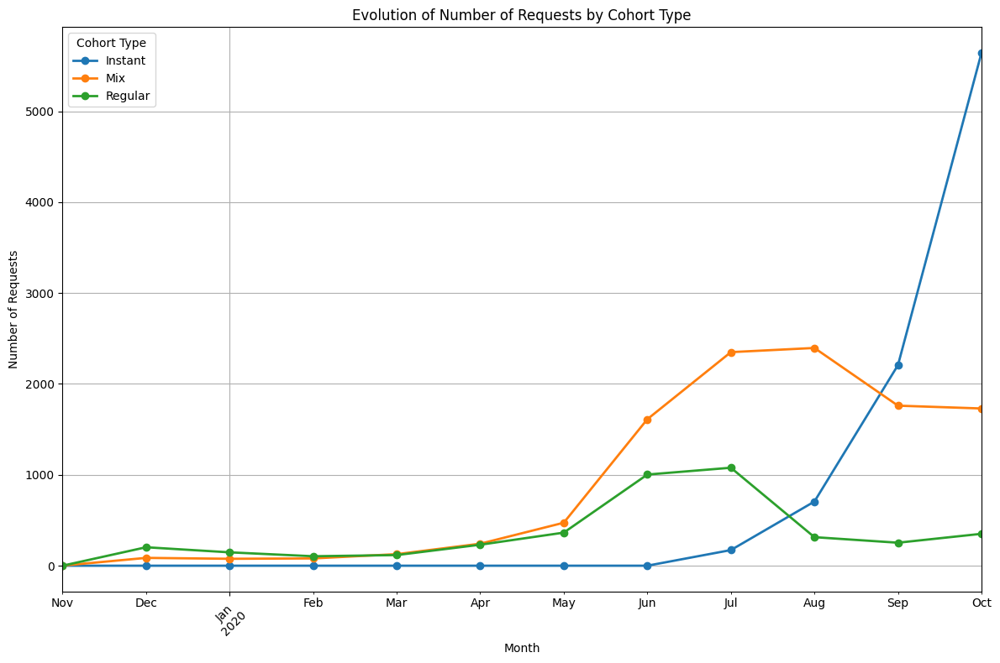

En este gráfico, observamos la evolución de cada grupo de usuarios:

- El **naranja** representa a los usuarios que migraron de "regular" a "instant", un cambio significativo.  
- El **verde** muestra a aquellos que se han mantenido en el servicio **regular**.  
- El **azul** destaca a los usuarios **100% Instant**.  

Se puede ver claramente el crecimiento **exponencial** de los usuarios 100% Instant, lo que refleja el impacto que este servicio ha tenido en el comportamiento de los clientes.

---

### **Análisis de los Top Clientes por Segmento**

A continuación, presentamos la comparación de los clientes principales de los tres segmentos:

- **Usuarios 100% Instant**  
  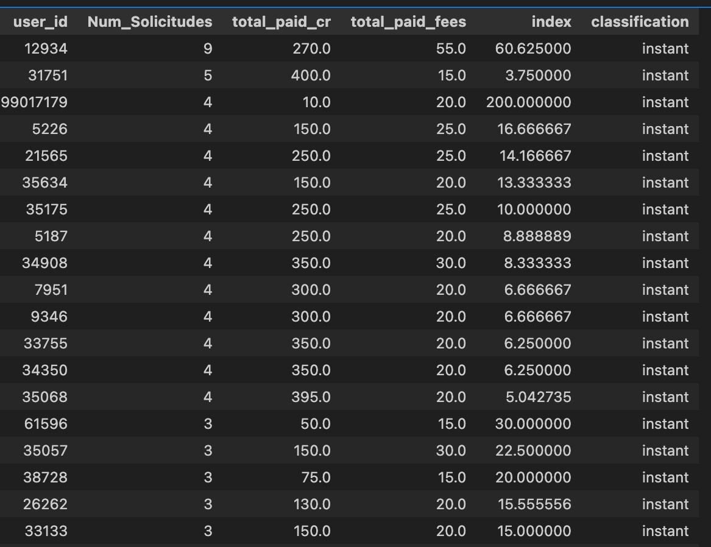

- **Usuarios 100% Regular**  
  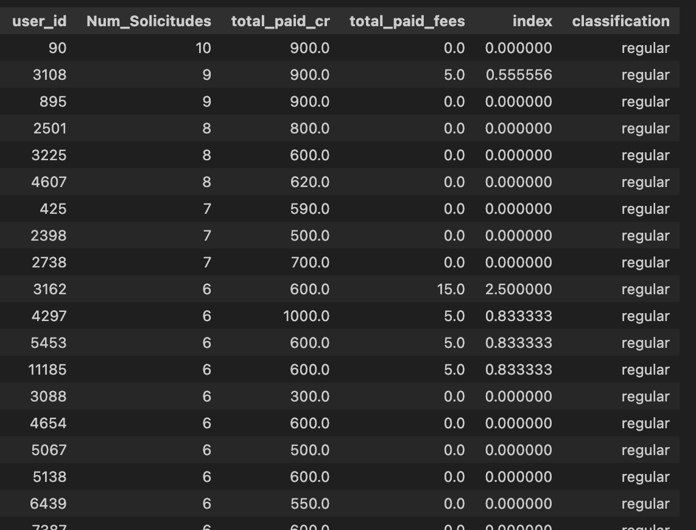

- **Usuarios Mixtos**  
  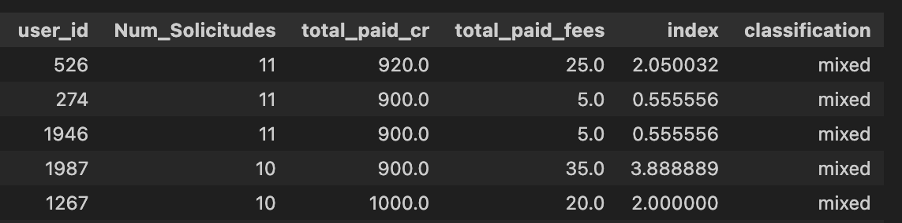

---

#### **Observaciones Finales**
A partir del análisis de estos tres segmentos:

- Aunque ha habido una **gran migración positiva** de usuarios del servicio regular al servicio mixto, aún existe un grupo que **prefiere mantenerse en el servicio regular**. Esto probablemente se debe a que no necesitan la inmediatez del crédito a cambio de un fee.
- Existe una **diferencia significativa en el comportamiento de los nuevos clientes**: aquellos que optan por el servicio Instant desde el inicio tienen un rendimiento mucho mayor en términos de ingresos y engagement.

---

### **Plan de Acción**

- **Iniciativa**: Invertir todos los esfuerzos en captar nuevos clientes que elijan el servicio Instant desde su primera solicitud.  

#### **Estrategia Comercial Específica**
- **Campañas de Marketing Dirigidas**: Lanzar campañas promocionales que destaquen los beneficios del servicio Instant, como la rapidez y conveniencia, utilizando canales digitales como redes sociales y correo electrónico.
- **Incentivos para Nuevos Usuarios**: Ofrecer un descuento en la primera solicitud del servicio Instant para motivar la adopción inicial.
- **Educación del Usuario**: Implementar comunicaciones claras en la aplicación y el sitio web que comparen visualmente los beneficios del servicio Instant frente al servicio regular.
- **Partnerships Estratégicos**: Colaborar con aplicaciones de finanzas personales o wallets digitales para integrar el servicio Instant y acceder a un público nuevo.

#### **Impacto Esperado**
- **Incremento en el Margen de Ingresos por Fees**: Gracias a un mayor engagement de los usuarios Instant.
- **Reducción de Costos**: Menor mantenimiento operativo para usuarios del servicio regular.
- **Mayor Retención**: Usuarios que adoptan el servicio Instant tienden a mostrar mayor fidelidad.
- **Posicionamiento del Servicio**: Instant se consolidará como la opción principal para nuevos usuarios, fortaleciendo la ventaja competitiva en el mercado.


