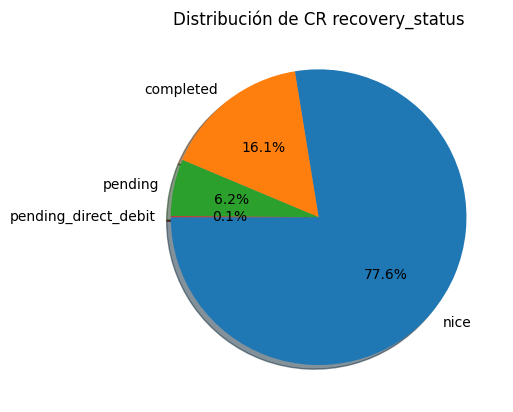
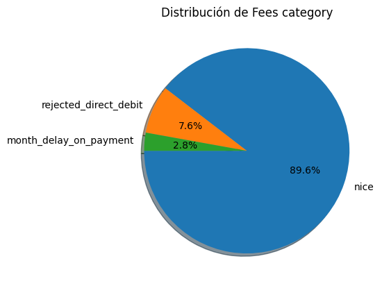
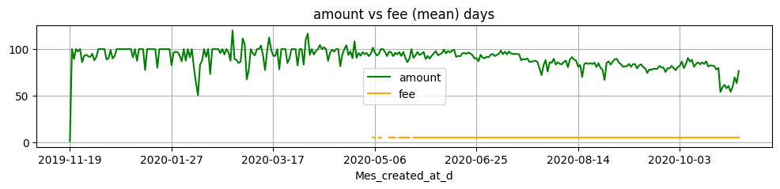
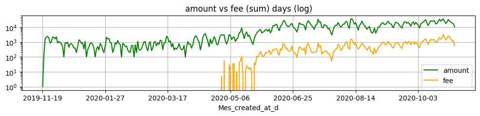
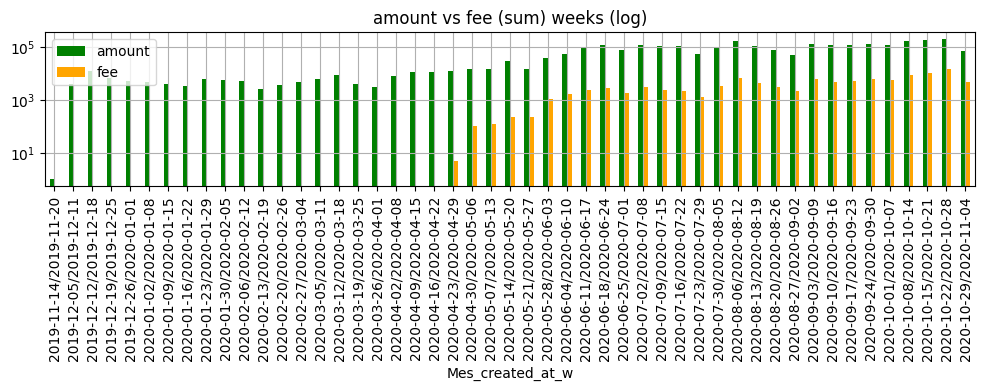
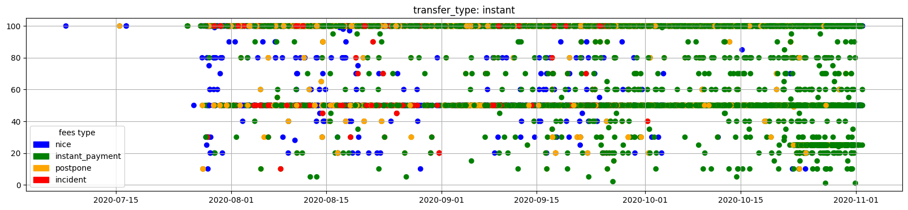
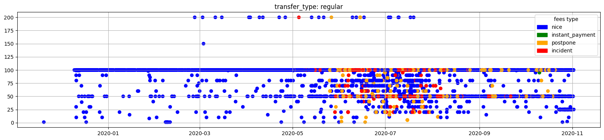
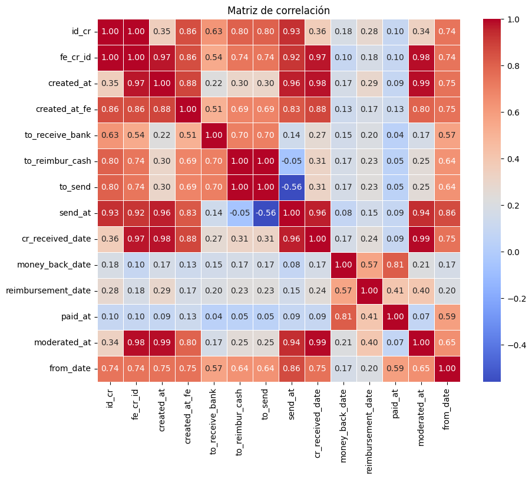
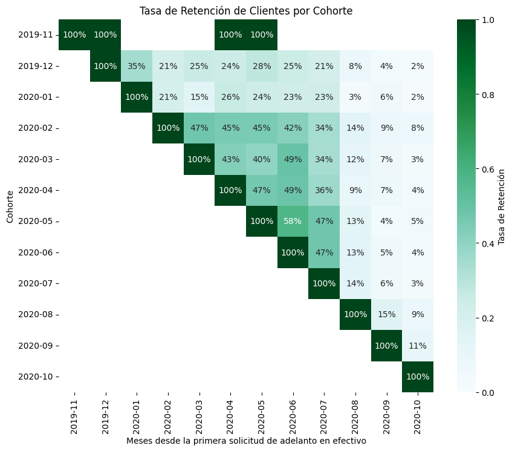
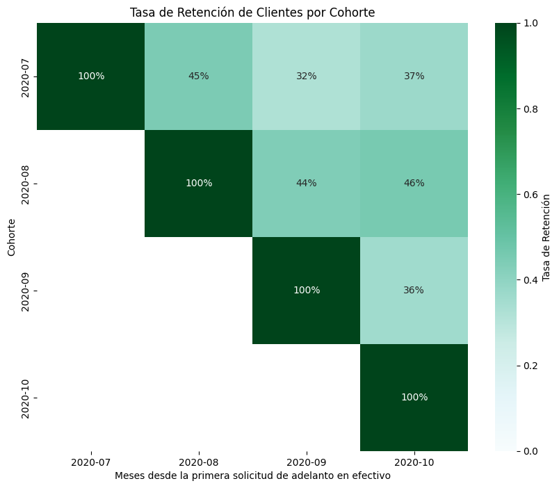

# Proyecto Pasta Loca

## Equipo del Proyecto

El equipo detrás de este análisis está compuesto por:

- **Francesc Pujol Contreras**: *Data Engineer*. Responsable de la limpieza de bases de datos, creación de pipelines de datos y desarrollo de librerías utilizadas por los analistas.
  
- **Maria Alba Godoy Dominguez**: *Business Analyst - Credit Risk Management*. Encargada del análisis de morosidad y riesgos crediticios.

- **Alejandro Manzano**: *Business Analyst - Profitability Analysis*. Enfocado en el análisis de la rentabilidad del negocio.


## Diagrama de Flujo del Servicio


## Métricas para Analizar Rentabilidad Financiera de BP

1. **% Revenue**:
```math
\text{\% Revenue} = \frac{\text{ingresos por fees de adelanto + ingresos por fees de prorrogas}}{\text{total adelantos}} \times 100
```

2. **Porcentaje de Adelantos con Fee**:
```math
\text{Porcentaje de adelantos con fee} = \frac{\text{adelantos con fee}}{\text{total adelantos}} \times 100
```

## Métricas para Analizar Comportamiento de Clientes de BP

1. **Porcentaje de Clientes Repetitivos**:
```math
\text{Porcentaje de clientes repetitivos} = \frac{\text{Clientes repetitivos}}{\text{Total de Clientes}} \times 100
```

2. **Porcentaje de Nuevos Clientes que Pagan Fees**:
```math
\text{Porcentaje de nuevos clientes que pagan fees} = \frac{\text{Clientes nuevos que pagan fees}}{\text{Total de clientes nuevos}} \times 100
```

3. **Porcentaje de Clientes Repetitivos que Pagan Fees**:
```math
\text{Porcentaje de clientes repetitivos que pagan fees} = \frac{\text{Clientes repetitivos que pagan fees}}{\text{Total de clientes repetitivos}} \times 100
```

4. **Tasa de Incumplimiento de Nuevos Clientes**:
```math
\text{Tasa de incumplimiento de nuevos clientes} = \frac{\text{Clientes nuevos que no cumplen el plazo}}{\text{Total de clientes nuevos}} \times 100
```

5. **Tasa de Incumplimiento de Clientes Repetitivos**:
```math
\text{Tasa de incumplimiento de clientes repetitivos} = \frac{\text{Clientes repetitivos que no cumplen el plazo}}{\text{Total de clientes repetitivos}} \times 100
```

---

## Estructura de los Datos

### Cash_Request (CR)

##### CR.Status (23970 registros)

- **money_back**: 16397 registros. El CR fue reembolsado exitosamente.
- **rejected**: 6568 registros. El CR necesitó una revisión manual y fue rechazado.
- **direct_debit_rejected**: 831 registros. El intento de débito directo SEPA falló.
- **active**: 59 registros. Los fondos fueron recibidos en la cuenta del cliente.
- **transaction_declined**: 48 registros. No se pudo enviar el dinero al cliente.
- **canceled**: 33 registros. El usuario no confirmó el CR en la app, fue cancelado automáticamente.
- **direct_debit_sent**: 34 registros. Se envió un débito directo SEPA, pero aún no se confirma el resultado.

| CR Status             | Regs(join y limpiar) |
| --------------------- | -------------------: |
| money_back            |                23268 |
| rejected              |                 6568 |
| direct_debit_rejected |                 1941 |
| active                |                  158 |
| direct_debit_sent     |                   74 |
| transaction_declined  |                   48 |
| canceled              |                   35 |


##### CR.Transfer Type

- **instant**: El usuario eligió recibir el adelanto instantáneamente.
- **regular**: El usuario eligió no pagar inmediatamente y esperar la transferencia.

| transfer_type | regs(join y limpiar) |
| ------------- | -------------------: |
| instant       |                19488 |
| regular       |                12604 |


##### CR.Recovery Status

- **null**: El CR nunca tuvo un incidente de pago.
- **completed**: El incidente de pago fue resuelto (el CR fue reembolsado).
- **pending**: El incidente de pago aún está abierto.
- **pending_direct_debit**: El incidente de pago sigue abierto, pero se ha lanzado un débito directo SEPA.

| recovery_status      | regs(join y limpiar) |
| -------------------- | -------------------: |
| nice (null)          |                24893 |
| completed            |                 5166 |
| pending              |                 1996 |
| pending_direct_debit |                   36 |
| cancelled            |                    1 |

### Fees (FE)

##### FE.Type

- **instant_payment**: Fees por adelanto instantáneo.
- **split_payment**: Fees por pago fraccionado (en caso de un incidente).
- **incident**: Fees por fallos de reembolsos.
- **postpone**: Fees por la solicitud de posponer un reembolso.

| type            | regs(join y limpiar) |
| --------------- | -------------------: |
| instant_payment |                11095 |
| nice  (null)    |                11037 |
| postpone        |                 7765 |
| incident        |                 2195 |

##### FE.Status

- **confirmed**: El usuario completó una acción que creó un fee.
- **rejected**: El último intento de cobrar el fee falló.
- **cancelled**: El fee fue creado pero cancelado por algún motivo.
- **accepted**: El fee fue cobrado exitosamente.

| stat_fe   | regs(join y limpiar) |
| --------- | -------------------: |
| accepted  |                14839 |
| cancelled |                 4934 |
| rejected  |                 1194 |
| confirmed |                   88 |

##### FE.Category

- **rejected_direct_debit**: Fees creados cuando el banco del usuario rechaza el primer débito directo.
- **month_delay_on_payment**: Fees creados cada mes hasta que el incidente se cierre.
- **null**: No figura a la documentacio

| category               | regs(join y limpiar) |
| ---------------------- | -------------------: |
| nice  (null)           |                18860 |
| rejected_direct_debit  |                 1598 |
| month_delay_on_payment |                  597 |

##### FE.Charge Moment

- **before**: El fee se cobra en el momento de su creación.
- **after**: El fee se cobra cuando el CR es reembolsado.

| charge_moment | Regs(join y limpiar) |
| ------------- | -------------------: |
| after         |                16719 |
| before        |                 4336 |

---
## Visión global de datos

### Distribución del campo recovery_status en Cash Request:

* (nice) Null if the cash request never had a payment incident.
* completed : the payment incident was resolved (=the cash request was reimbursed)
* pending : the payment incident still open
* pending_direct_debit : the payment incident still open but a SEPA direct debit is launched




### Distribución del campo category en Fees (incidencias en Fees):

* rejected_direct_debit : fees created when user's bank rejects the first direct debit
* month_delay_on_payment : fees created every month until the incident is closed




### Evolucion de la cantidad de IDs en Cash Request a lo largo del tiempo.


> Podemos observar la periodicidad semanal y un periodo en septiembre del 2020 donde cae la cantidad, donde podriamos profundizar en detalle.


### Examinar casos de clientes concretos

* Clientes que identificamos como "Vips" al examinar en detalle su cantidad de prestamos:
    * 1946 Parece un ejemplo de buena gestión, al final tiene un instant y se le ha dado margen en las demoras.
    * 1987 Parece un ejemplo de buen usuario, se pasa a instant para siempre.
    * 90 Este parece que se esté gestionando mal: todos instant, con demoras y sin gestión aparente ?.
    * Algunos más: 12934, 526, ...


> Nos ha resultado muy útil consultar los datos con un pequeño bloque de código en vez de recurrir constantemente a una hoja de calculo.

### Fechas faltantes, se han calculado la medias:

* 2,94 días de demora promedio en las transferencias bancarias.
* 31.6: Promedio del tiempo que tarda la empresa en cobrar los fee.
> Este podría ser un caso donde se puede crear un modelo para realizar la interpolación de los datos faltantes.


### Identificar datos erróneos e incorporarlos en la librería:

El cliente a devuelto el préstamo pero en los datos no figura la fecha de reembolso del banco o la fecha establecida en el sistema.

```python
df_jo['money_back_date'] = df_jo.apply(
            lambda row: row['reimbursement_date'] 
            if ( pd.isna(row['money_back_date']) & (row['stat_cr'] == 'money_back') ) 
            else row['money_back_date'], axis=1
        )
df_jo['cr_received_date'] = df_jo.apply(
    lambda row: row['send_at']+ pd.DateOffset(days=3) 
    if ( pd.isna(row['cr_received_date']) & (row['stat_cr'] == 'money_back') ) 
    else row['cr_received_date'], axis=1
)
```

### Segmentación:

### Retraso (por ID de Cash Request) al devolver el préstamo detallando el tipo de Fee:


### Retraso (por Fecha de Cash Request) al devolver el préstamo detallando el tipo de Fee:


### Comparacion de prestamos y fees


> Se observa el momento en el que se introducen los prestamos instant y empieza el cobro de fees





> Se observa la adoción por parte de los usuarios del servicio que implica pagos.


### Importes de los prestamos





### Correlaciones descartando columnas auxiliares de fechas



### Campos cualitativos a cuantitativos


### Analisis de Series Temporales y Ruido asociado


> Se aprecia un aspecto semanal de los datos al ver la evolucion a lo largo del periodo.
---

## Profitability Analysis

###  Analysis of Revenue Growth and Fee Behavior:

Antes de proceder al análisis, es importante aclarar los conceptos que estamos utilizando:

- **Total Adelantos**: Se han considerado todos los adelantos que estamos seguros que la empresa ha pagado, es decir, aquellos cuyo `cash_request_received_date` no es nulo, lo que indica que el adelanto fue efectivamente recibido por el cliente.
  
- **Total Fees**: Para el análisis de los fees, se han tomado en cuenta aquellos que han sido **efectivamente cobrados**, es decir, aquellos cuyo **status del fee** es **"accepted"**.

El análisis comenzó observando la evolución del índice **% Revenue** en total y por cada servicio.


Se observa un importante aumento de la rentabilidad del negocio desde 07-2020, alcanzando un incremento del KPI de un **41%** entre 07-2020 y 10-2020.

A continuación, analizamos la composición de este KPI para determinar si el aumento se debe a un incremento en el cobro de fees o a una reducción en los montos prestados.


Entre 07-2020 y 10-2020, vemos que hubo un aumento de los adelantos del **147%**, mientras que los fees crecieron un **500%**.

Con esta información, pasamos a analizar más detalladamente el comportamiento de los fees.


En esta gráfica, podemos ver claramente que el crecimiento exponencial de los fees se debe al éxito del servicio **Instant**.

A continuación, nos centramos en el servicio **Instant** para analizar los diferentes sub-servicios ofrecidos, específicamente las dos opciones de pago de fees: **before** y **after**.


El **82%** de los **CR** de **Instant Payment** utilizan el sub-servicio **after**. Al observar la evolución en el tiempo, vemos una tendencia creciente en ambos sub-servicios, sin que haya una transferencia significativa de uno a otro. Lo que sí se observa es un aumento más pronunciado en el servicio **after**.


A continuación, analizamos la morosidad en cada uno de estos dos sub-servicios, con la hipótesis de que el servicio **"after"** podría ser más susceptible a la morosidad. Sin embargo, sorprendentemente encontramos lo contrario:


Como se puede ver, la tasa de impagos del sub-servicio **"charge moment"** en el servicio **Instant** es mayor para los clientes que pagan **before** que para los que pagan **after**. Dado que el sub-servicio **before** representa solo el **20%**, podemos proponer nuestro primer plan de acción:

### PLAN DE ACCIÓN:
**Eliminar el subservicio "charge moment" del servicio Instant.**

### IMPACTO:
- **Morosidad general ponderada con ambos servicios** = **28,4%**.
- **Eliminando el subservicio "before"** reduciría la morosidad general ponderada solo con **after** a **25%**, lo que representaría una reducción del **3%** en la morosidad.


# **Cohortes: Segmentaciones para Análisis**

Hemos realizado un análisis de cohortes basado en la fecha de la primera solicitud de adelanto. Para este análisis, tomamos las siguientes asunciones clave:

1. Se consideran **solo los fees pagados**.
2. Se consideran **solo adelantos con certeza de haber sido pagados por BP** (es decir, aquellos con el campo `cash_request_received_date` no nulo).

---

### **Diagrama de Cohortes**


Al observar la **primera diagonal** del gráfico, podemos ver el **porcentaje de ingresos** para cada cohorte respecto a su primera solicitud de adelanto de efectivo. Es evidente que este valor aumenta con el tiempo, especialmente antes del **boom del servicio Instant**, periodo en el que se acentúa este crecimiento.

Este aumento en el índice se debe al auge del servicio **Instant**, por lo que realizamos una cohorte provisional para segmentar a los usuarios en tres grupos:

1. **Usuarios 100% Instant**
2. **Usuarios 100% Regular**
3. **Usuarios Mixtos**

---

### **Evolución de las Cohortes**


En este gráfico, observamos la evolución de cada grupo de usuarios:

- El **naranja** representa a los usuarios que migraron de "regular" a "instant", un cambio significativo.  
- El **verde** muestra a aquellos que se han mantenido en el servicio **regular**.  
- El **azul** destaca a los usuarios **100% Instant**.  

Se puede ver claramente el crecimiento **exponencial** de los usuarios 100% Instant, lo que refleja el impacto que este servicio ha tenido en el comportamiento de los clientes.

---

### **Análisis de los Top Clientes por Segmento**

A continuación, presentamos la comparación de los clientes principales de los tres segmentos:

- **Usuarios 100% Instant**  
  

- **Usuarios 100% Regular**  
  

- **Usuarios Mixtos**  
  

---

#### **Observaciones Finales**
A partir del análisis de estos tres segmentos, podemos destacar los siguientes puntos clave:

- Aunque ha habido una **gran migración positiva** de usuarios del servicio regular al servicio mixto, aún existe un grupo que **prefiere mantenerse en el servicio regular**. Este comportamiento probablemente se debe a que estos usuarios no perciben la necesidad de la **inmediatez del crédito** que ofrece el servicio Instant, prefiriendo no pagar el fee adicional.
  
- Existe una **diferencia significativa en el comportamiento de los nuevos clientes**: aquellos que optan por el servicio Instant desde el inicio tienen un rendimiento **mucho mayor** en términos de ingresos y engagement, mostrando una preferencia clara por la rapidez y la accesibilidad.

Si analizamos las tasas de retención (retention rate) por cohortes de la **primera solicitud de crédito** entre los usuarios del servicio regular y los usuarios del servicio Instant, observamos lo siguiente:

---

### **Tasas de Retención por Cohorte**

- **Retención de Usuarios del Servicio Regular**

  

- **Retención de Usuarios del Servicio Instant**

  

---

Al interpretar estos gráficos, es importante considerar lo siguiente:

- En el gráfico de **retención de usuarios del servicio regular**, observamos que **antes del lanzamiento de Instant (07-2020)**, las tasas de retención eran aproximadamente del **45%**, lo que indica un comportamiento más estable y constante en ese segmento.
  
- En el gráfico de **retención de usuarios Instant**, las tasas de retención son ligeramente más bajas, rondando el **40%**, pero este grupo tiene un **índice mucho más alto de adquisición de nuevos clientes**, lo que compensa la menor tasa de retención. Esto refleja la **alta atracción** del servicio Instant, aunque con una ligera disminución en la retención a largo plazo.

Esto confirma que, aunque el servicio Instant presenta una ligera disminución en la retención, su capacidad de atraer nuevos clientes y generar un mayor ingreso por cliente es clave para el crecimiento a largo plazo del negocio.

---

### **Plan de Acción**

- **Iniciativa**: Invertir todos los esfuerzos en captar nuevos clientes que elijan el servicio Instant desde su primera solicitud.  

#### **Estrategia Comercial Específica**
- **Campañas de Marketing Dirigidas**: Lanzar campañas promocionales que destaquen los beneficios del servicio Instant, como la rapidez y conveniencia, utilizando canales digitales como redes sociales y correo electrónico.
- **Incentivos para Nuevos Usuarios**: Ofrecer un descuento en la primera solicitud del servicio Instant para motivar la adopción inicial.
- **Educación del Usuario**: Implementar comunicaciones claras en la aplicación y el sitio web que comparen visualmente los beneficios del servicio Instant frente al servicio regular.
- **Partnerships Estratégicos**: Colaborar con aplicaciones de finanzas personales o wallets digitales para integrar el servicio Instant y acceder a un público nuevo.

#### **Impacto Esperado**
- **Incremento en el Margen de Ingresos por Fees**: Gracias a un mayor engagement de los usuarios Instant.
- **Reducción de Costos**: Menor mantenimiento operativo para usuarios del servicio regular.
- **Mayor Retención**: Usuarios que adoptan el servicio Instant tienden a mostrar mayor fidelidad.
- **Posicionamiento del Servicio**: Instant se consolidará como la opción principal para nuevos usuarios, fortaleciendo la ventaja competitiva en el mercado.


